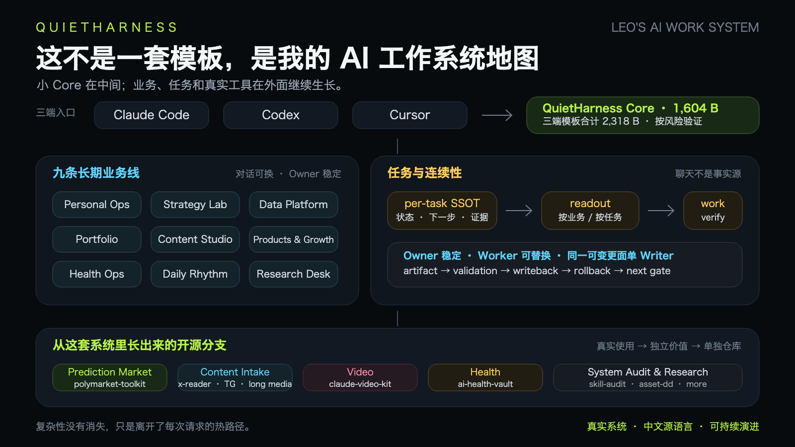

# QuietHarness：让你的 AI 编程 Agent 更可靠

[](LICENSE)

**中文** · [English](README.en.md)

> 给你已经在使用的 AI 编程 Agent 装上一层极小、可回滚的工作边界：先看现状、保留无关改动、按风险验证、对不可逆动作先确认。

**只用 Claude Code、Codex 或 Cursor 中的一个就能获得同一组核心可靠性边界。** 多端兼容是以后更换工具时可以带走这些边界，不是安装门槛。

QuietHarness 不会给每个请求套一层仪式，也不是要求你复制我的私人系统。它把我长期使用后仍值得保留的行为压缩成 1,604 字节共享 Core，并提供 dry-run、备份、隔离测试和可逆安装。

## 适合谁

适合正在用任意一种 AI 编程 Agent 维护真实项目，并遇到过这些问题的人：

- Agent 没检查现有改动就覆盖文件；
- 没运行测试，却把任务说成完成；
- 一个小修改被扩成不必要的重构和流程；
- 删除、发布、生产变更或凭证操作没有在正确位置停下来确认；
- 更换 Agent 后，又要从头重写同一套基本边界。

如果你需要完整任务数据库、后台自动化或团队编排平台，QuietHarness 本身并不提供这些能力；后文的 Leo System 只是可选参考。

## 先在一个隔离项目试用

```bash
git clone https://github.com/runesleo/claude-code-workflow.git
cd claude-code-workflow
./scripts/inventory.sh

demo_dir="$(mktemp -d "${TMPDIR:-/tmp}/quiet-harness-first-success.XXXXXX")"
./examples/first-success/setup.sh "$demo_dir"
```

下面三个选项只选一个。先 dry-run 查看精确目标，再执行 `--apply`；试用规则只写入 `$demo_dir`，不会改动你的用户级 Claude/Codex 配置。

### Claude Code

```bash
./scripts/install.sh --dry-run --claude-project "$demo_dir"
./scripts/install.sh --apply --claude-project "$demo_dir"
```

写入 `$demo_dir/AGENTS.md` 与 `$demo_dir/CLAUDE.md`。

### Codex

```bash
./scripts/install.sh --dry-run --codex-project "$demo_dir"
./scripts/install.sh --apply --codex-project "$demo_dir"
```

只写入 `$demo_dir/AGENTS.md`。

### Cursor

```bash
./scripts/install.sh --dry-run --cursor-project "$demo_dir"
./scripts/install.sh --apply --cursor-project "$demo_dir"
```

只写入 `$demo_dir/.cursor/rules/quiet-harness.mdc`。

安装器默认只预览；明确 `--apply` 才写入。它不联网、不登录账号、不修改 scheduler。

## 观察第一次成功

在 `$demo_dir` 打开你选择的 Agent，只发送：

```text
Read TASK.md and complete the task.
```

成功时，它应当在没有被题目逐条提醒的情况下，发现并保留一条无关用户改动、只修折扣计算、运行现有测试，并在最终回复中给出真实验证证据。

这个练习是 onboarding 行为检查，不是“QuietHarness 必然提升模型”的因果实验。设计目标是十分钟内完成；目前自动化只验证 fixture 可重复，真实非作者计时仍是下一道产品门。

[查看完整首次成功步骤与验收标准 →](examples/first-success/README.md)

## 通过后再安装到日常环境（可选）

```bash
# Claude Code 用户级
./scripts/install.sh --dry-run --claude
./scripts/install.sh --apply --claude

# Codex 用户级
./scripts/install.sh --dry-run --codex
./scripts/install.sh --apply --codex

# 或继续只给某个真实项目安装 --*-project
```

Claude 用户级安装影响 `~/AGENTS.md` 与 `~/.claude/CLAUDE.md`；Codex 影响 `$CODEX_HOME/AGENTS.md`，默认是 `~/.codex/AGENTS.md`。覆盖已有文件前会在原位置创建带时间戳的 `.bak-ai-workflow-*` 备份。恢复时先保留当前文件，再把你明确选中的备份移回原路径；完整步骤见 [v3 迁移与回滚](MIGRATION-v3.md#回滚)。

安装器会为每个目标分别输出 `INSTALLED <目标>`；只有覆盖旧文件的目标才会紧邻输出 `BACKUP <备份>`。卸载时逐个判断：有对应 `BACKUP` 就恢复那一份；没有对应 `BACKUP` 才表示该目标由 QuietHarness 新建。对新建目标，先确认它仍与模板一致，再只移除那一个精确路径；若已被你修改，先移到别处而不是删除。

## 为什么叫 QuietHarness

最早开源这套 workflow 时，模型远没有现在稳定。为了不失忆、不乱跑、不漏验证，我不断往里面加规则、Hook、Skill、Memory、模型路由、Morning、Today 和 Session End。

那些设计不是凭空来的，当时确实解决了问题。但仓库发布以后，我继续用 Claude Code、Codex、Cursor 和不同模型迭代自己的系统，公开仓库却很久没有同步。

最近重新使用最高推理档的模型后，我的实际感受是：模型本身已经强到足以承担更多路径判断。旧系统里一部分原本有用的保护，开始变成重复规划、误触流程和维护负担。

所以 v3 不是继续加功能，而是把我目前真实使用的结构重新公开：

- 三端常驻配置从重规则系统收敛为一个小 Core；
- 项目事实留在项目里，需要时才读；
- 业务与任务连续性放在明确的事实源和写回协议后面；
- 日报与监控继续后台运行，但不再成为每次开工的仪式；
- 已经长成独立工具的业务分支，继续由各自仓库维护。

我把这个版本叫 **QuietHarness**：Harness 仍然在，但没有相关任务时，它应该安静。

> 仓库地址和 Git 历史继续保留 `claude-code-workflow`。QuietHarness 是同一套系统的 v3，不是另起炉灶。

## 一张图看懂



```text
Leo 的真实工作
    │
    ├── Claude Code / Codex / Cursor
    │       └── QuietHarness Core
    │             直接执行 · 真实证据 · 按风险验证 · 不可逆动作确认
    │
    ├── 长期业务线
    │       Personal Ops · Strategy · Data · Portfolio · Content
    │       Products · Health · Daily Rhythm · Research
    │
    ├── 任务与连续性
    │       per-task SSOT · owner/worker · readout/writeback
    │       freshness · claim · writer lock · artifact/receipt
    │
    └── 已开源的业务分支
            Polymarket · 内容读取 · 视频制作 · 健康 · 系统审计
```

复杂性没有消失，只是离开了每次请求的热路径。

## 这套系统现在怎么工作

### 1. 一个 Core，任选一个客户端

Claude Code、Codex 和 Cursor 都能获得同一组核心可靠性行为，但你只需要安装自己正在使用的客户端。Codex 直接读取 shared `AGENTS.md`，Claude Code 通过薄入口引用它；Cursor 项目规则以适合 `.mdc` 的形式镜像同一组边界。

| 客户端 | 常驻模板 | 字节数 |
|---|---|---:|
| Shared Core | `templates/shared/AGENTS.md` | 1,604 B |
| Claude Code adapter | `templates/claude/CLAUDE.md` | 168 B |
| Cursor project rule | `templates/cursor/quiet-harness.mdc` | 546 B |

三份模板合计 2,318 字节，但任何一个客户端都不会同时加载三份。增加第二个客户端只是复用同一组行为边界，不会解锁隐藏的“完整版”。这里比较的是文件字节，不冒充精确 token、速度或模型质量数据。

Core 只保留四类东西：

- 直接推进当前请求；
- 没看过的文件、网页和历史不装作看过；
- 文件或代码改动后按风险验证；
- 资金、账号、公开发布、生产环境和破坏性动作先确认。

### 2. 九条业务线：对话可以换，业务归属不变

我的长期工作不是一个无限增长的聊天窗口，而是九条稳定业务线：

| 入口 | 业务线 | 负责什么 |
|---|---|---|
| ⌘0 | Personal Ops | 系统、Agent 与风险边界 |
| ⌘1 | Strategy Lab | 策略、验证与扩张 |
| ⌘2 | Data Platform | 数据管线、索引与画像 |
| ⌘3 | Portfolio | 配置、风险与执行决策 |
| ⌘4 | Content Studio | X、文章与 SEO |
| ⌘5 | Products & Growth | 构建、变现与分发 |
| ⌘6 | Health Ops | 记录、节律与健康研究 |
| ⌘8 | Daily Rhythm | 输入登记、路由与日常审计 |
| ⌘9 | Research Desk | 调研、机会与知识沉淀 |

这些名字不是要求别人照抄，而是公开我的真实拓扑。每条线对应一个稳定工作区和 Owner；换模型、换对话甚至换客户端，都不会改变事实应该写回哪里。

启动时只读当前业务线的有限状态。明确点名任务时，才读取那一个任务。完整结构见 [系统架构](docs/ARCHITECTURE.md)。

### 3. 任务系统：事实比聊天记忆可靠

任务不是一个让所有模型共同改写的大数组，而是每个任务一份权威记录：

- `status` 是唯一生命周期事实；
- `owner_thread` 表示稳定业务归属；
- `primary_worker` / `claimed_by` 只表示当前执行者；
- `next_action`、`artifacts`、`updated_at` 必须明确；
- 新事实与旧叙事冲突时，用 `state_revision` 明确覆盖；
- Worker 的一句“完成了”不算持久状态，必须有 artifact、validation 和 Owner writeback。

仓库提供一份从我现行结构脱敏而来的 [任务示例](examples/leo-system/task.example.json) 和 [完整说明](docs/TASK-CONTINUITY.md)。它不是虚构的通用 schema，但也不会暴露我的实时任务库。

### 4. 单 Writer：并行调查，串行修改同一事实

Claude、Codex、Cursor 可以并行研究和审查，但同一个仓库或同一个任务事实面默认只有一个 Writer。

一次仓库写入会记录：

```text
repo / worktree / writer / allowed paths / validation / next gate
```

释放写锁时必须留下：

```text
artifact / validation / writeback / rollback / outcome / next gate
```

这来自真实的跨模型双写事故，不是为了让流程看起来完整。脱敏示例见 [writer-lock.example.json](examples/leo-system/writer-lock.example.json)。

### 5. 后台报告：继续生成，不抢前台注意力

日报、同步和监控可以继续独立运行。成功时安静落盘，需要时读取；缺失、过期或失败时再提醒。

交互 Agent 不需要为了回答一个无关问题，先重跑 Morning、扫描全部任务或生成一次 Dashboard。详见 [日报可以继续，但不必成为仪式](docs/DAILY-REPORTS.md)。

## 这张地图上的开源分支

QuietHarness 是主干。我的一些真实业务能力已经长成独立仓库：

| 系统分支 | 公开仓库 | 在整套系统里的位置 |
|---|---|---|
| 预测市场 | [polymarket-toolkit](https://github.com/runesleo/polymarket-toolkit) | 地址画像、CLI 与 AI Skills |
| 资产调研 | [asset-dd-and-opportunity-evaluation](https://github.com/runesleo/asset-dd-and-opportunity-evaluation) | 结构化 DD 与机会判断 |
| 内容摄入 | [x-reader](https://github.com/runesleo/x-reader) | 多平台链接读取与统一内容入口 |
| Telegram 摄入 | [tg-reader-mcp](https://github.com/runesleo/tg-reader-mcp) | TG 频道、群组与联系人读取 |
| 长音视频 | [long-media-cli](https://github.com/runesleo/long-media-cli) | 长视频、播客与 X Space 转录 |
| 视频制作 | [claude-video-kit](https://github.com/runesleo/claude-video-kit) | 脚本、审稿、配音与 Remotion 竖屏视频 |
| 健康资料 | [ai-health-vault](https://github.com/runesleo/ai-health-vault) | 私有健康记录与 AI/Obsidian 工作流 |
| 系统体检 | [claude-skill-audit](https://github.com/runesleo/claude-skill-audit) | Skill 使用率、冲突与死亡配置审计 |

它们不是为了凑一个“AI OS”目录，而是先在真实业务里使用，再把有独立价值的分支拆出去。未来新的公开仓库也会继续挂回这张地图。

## 需要时再扩展

首次成功只需要上面的 Core。以下结构是可选扩展，不是开始使用 QuietHarness 的前置知识。

### 借用我的系统结构

从 [Leo System 示例](examples/leo-system/) 开始：

1. 保留或重命名九条业务线；
2. 给每条线指定稳定 Owner 和工作区；
3. 用 per-task 记录保存状态、下一步与证据；
4. 接入自己的 readout/writeback；
5. 只有出现真实冲突时，再加入 claim 或 writer lock。

### 从 v2 迁移

先运行只读盘点，再按 [MIGRATION-v3.md](MIGRATION-v3.md) 可逆停用旧规则、Skill、Hook 和固定日流程。不要直接删除已有配置。

## 仓库结构

```text
templates/                      # 当前三端小 Core
docs/                           # 我的系统架构、任务与日报边界
examples/first-success/         # 单客户端隔离试用与行为验收
examples/leo-system/            # 脱敏的真实结构示例
scripts/                        # 盘点、安装、验证
tests/                          # 隔离 HOME 冒烟测试
media/launch-v3/                # 系统地图与发布素材
MIGRATION-v3.md                 # v2 → v3 与回滚
```

## 已验证

`./scripts/verify.sh` 会检查：

- Shell 语法与隔离安装；
- dry-run、多目标预检、备份与回滚；
- 文件和目录符号链接盘点；
- 自定义 `CODEX_HOME`；
- 中英文入口、系统文档与示例；
- 私人路径和实时任务模式泄漏；
- 常驻模板体积上限；
- SVG/JSON 基础完整性与 `git diff --check`。

当前验证基线：三端模板合计 **2,318 字节**，安装器不需要 API key，也不执行网络、账号、scheduler 或生产操作。

这些检查证明安装与仓库契约可重复，不代表陌生用户已经获得产品价值。新的首次成功练习把 activation 变成可观察行为；下一步将以非作者实际完成记录验证，而不是用 stars 或浏览量替代。

## 当前边界

- 公开的是我的系统结构，不是我的实时任务、账号、仓位、健康记录或客户数据。
- 仓库不会替你创建任务数据库、九条置顶对话或后台 scheduler。
- `task-read`、`writeback` 和 writer lock 示例需要接到你自己的存储与客户端。
- Cursor 全局 User Rules 仍需在应用设置中管理；安装器只写项目规则。
- Windows PowerShell 安装器尚未提供。

## 接下来

我不会再为了显得完整而给它堆功能。当前产品化顺序是：

1. 让至少一位非作者在没有口头解释的情况下完成首次成功；
2. 根据真实失败点缩短安装、恢复或验收路径；
3. 再扩到三位用户、重复使用和第三方集成。

后续功能仍只来自两类证据：我在真实工作里反复验证有效，或使用者在 issue、fork、教程、集成和重复使用中证明值得抽出来。

## 关于作者

Leo（[@runes_leo](https://x.com/runes_leo)）— AI × Crypto 独立构建者，用 Claude Code、Codex 和 Cursor 经营交易、数据、内容与开源产品。

[leolabs.me](https://leolabs.me) · [GitHub](https://github.com/runesleo) · [X](https://x.com/runes_leo)

## License

MIT — 见 [LICENSE](LICENSE)。
